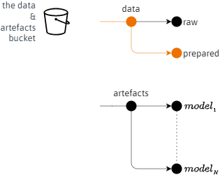

 

## STRUCTURES

This repository's image:

* Reads the project's raw data from its Amazon S3 (Simple Storage Service) bucket partition; bucket & partitions illustration below.  
* Structures the data in preparation for the modelling stage.
* Delivers the structured data to the Amazon S3 bucket; orange path. 

 

    

 
 

The structured data is delivered to the <i>prepared</i> partition; orange path.

 
 

 
 

 
 

 
 
